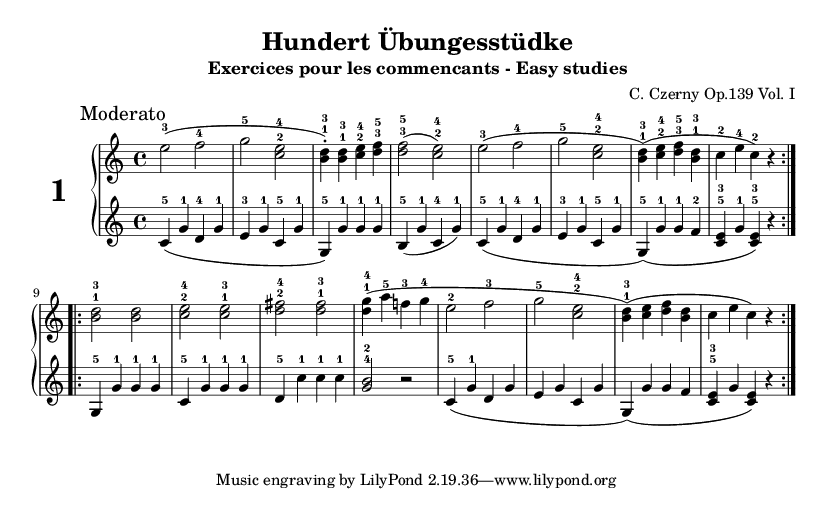

Music by [Carl Czerny](https://en.wikipedia.org/wiki/Carl_Czerny) (1791 – 1857).

Current content:
* Czerny Op.139 Scores: 1-3

To generate the scores, install [LilyPond](http://www.lilypond.org/), and run 'make'.

### Why does this repository exist?

While studying these pieces and finding no quality MIDI files or PDFs for the,
I figured that I might as well create, from [older material](https://www.google.com/search?q=czerny-100-progressive-studies-op-139). From an educational
perspective, it also brings the side effect of arousing awareness of every
little detail in the score.

### Can you make the PDFs available? I am too lazy to install LilyPond.

Just open an issue if it really matters to you.
